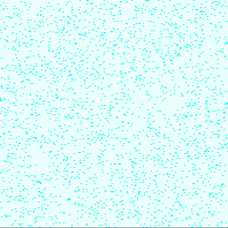
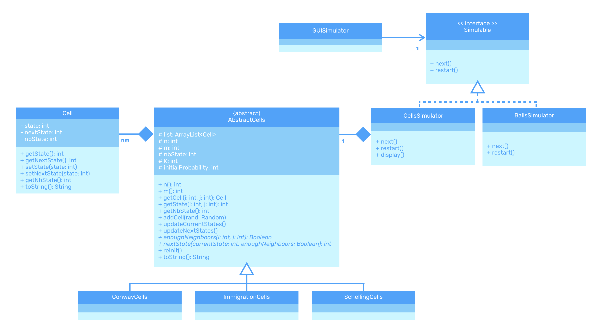

# Multiagent Systems Modeling in java

- Simple bouncing balls
- [Conway's game of life](https://en.wikipedia.org/wiki/Conway%27s_Game_of_Life#Rules)
- [The immigration game](https://en.wikipedia.org/wiki/Cyclic_cellular_automaton)
- [Schelling's segregation model](http://nifty.stanford.edu/2014/mccown-schelling-model-segregation/)

## Getting started

### Compilation

The simulations can be compiled all at once:
```sh
make all
```
Or one by one:
```sh
make compileBouncingBalls
make compileConway
make compileImmigration
make compileSchelling
```

### Lauching the simmulations

```sh
make exeBouncingBalls
make exeConway
make exeImmigration
make exeSchelling
```

### Other make functionalities

Creating the javadoc in `./javadoc`

```sh
make javadoc
```
Cleaning (`bin/*.class` and `./javadoc`)
```sh
make clean
```

## Simulation parameters

The simulation parameters parameters can easily be modified in the `src/Test*` files. Here is for instance the simulation parameters of the Schelling simmulation:

```java
// Parameters of the simulation
int n = 200; // number of cells vertically
int m = 200; // number of cells horizontally
int nbState = 3; // number of possible states for a cell (empty not included)
int K = 3; // number of neighboors threshold
int initialProbability = 50; // probability (percentage) for a cell not to start empty
```

## Result examples

Here are some example simulation results:

### Bouncing balls

Random directions, velocities, sizes and colors.


### Conway game
```java
// Parameters of the simulation
int n = 200; // number of cells vertically
int m = 200; // number of cells horizontally
int initialProbability = 6; // probability (percentage) that a cell will begin the simulation alive
```



### Immigration game

```java
// Parameters of the simulation
int n = 200; // number of cells vertically
int m = 200; // number of cells horizontally
int nbState = 3; // number of possible states for a cell
int K = 3; // number of neighboors threshold
int initialProbability = 70; // probability (percentage) for a cell to start at a state > 0
```


### Schelling model

```java
// Parameters of the simulation
int n = 200; // number of cells vertically
int m = 200; // number of cells horizontally
int nbState = 3; // number of possible states for a cell (empty not included)
int K = 3; // number of neighboors threshold
int initialProbability = 50; // probability (percentage) for a cell not to start empty
```


## Conception choices



- Note : when updating the next states of the cells, we use an iterator that returns all the values between 0 and a max value in a random order. That insures the realism of the model. (see `ShuffleIterator`)
