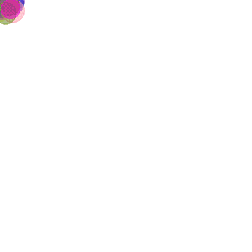

# Multiagent Systems Modeling in java

*Second year Java project at Ensimag - Grenoble INP - 2017*


- Simple bouncing balls
- [Conway's game of life](https://en.wikipedia.org/wiki/Conway%27s_Game_of_Life#Rules)
- [The immigration game](https://en.wikipedia.org/wiki/Cyclic_cellular_automaton)
- [Schelling's segregation model](http://nifty.stanford.edu/2014/mccown-schelling-model-segregation/)

## Getting started

### Compilation

The simulations can be compiled all at once:
```sh
make all
```
Or one by one:
```sh
make compileBouncingBalls
make compileConway
make compileImmigration
make compileSchelling
```

### Lauching the simmulations

```sh
make exeBouncingBalls
make exeConway
make exeImmigration
make exeSchelling
```

### Other make functionalities

Creating the javadoc in `./javadoc`

```sh
make javadoc
```
Cleaning (`bin/*.class` and `./javadoc`)
```sh
make clean
```

## Simulation parameters

The simulation parameters parameters can easily be modified in the `src/Test*` files. Here is for instance the simulation parameters of the Schelling simmulation:

```java
// Parameters of the simulation
int n = 200; // number of cells vertically
int m = 200; // number of cells horizontally
int nbState = 3; // number of possible states for a cell (empty not included)
int K = 3; // number of neighboors threshold
int initialProbability = 50; // probability (percentage) for a cell not to start empty
```

## Result examples

Here are some example simulation results:

### Bouncing balls

Just some bouncing balls with random directions, velocities, sizes and colors. Because why not? 🙃



### [Conway game](https://en.wikipedia.org/wiki/Conway%27s_Game_of_Life#Rules)


>The universe of the Game of Life is an infinite two-dimensional orthogonal grid of square cells, each of which is in one of two possible states, alive or dead, or "populated" or "unpopulated". Every cell interacts with its eight neighbours, which are the cells that are horizontally, vertically, or diagonally adjacent. At each step in time, the following transitions occur:
>
>1. Any live cell with fewer than two live neighbours dies, as if caused by underpopulation.
>1. Any live cell with two or three live neighbours lives on to the next generation.
>1. Any live cell with more than three live neighbours dies, as if by overpopulation.
>1. Any dead cell with exactly three live neighbours becomes a live cell, as if by reproduction.

```java
// Parameters of the simulation
int n = 200; // number of cells vertically
int m = 200; // number of cells horizontally
int initialProbability = 10; // probability (percentage) that a cell will begin the simulation alive
```


### [Immigration game](https://en.wikipedia.org/wiki/Cyclic_cellular_automaton)

>As with any cellular automaton, the cyclic cellular automaton consists of a regular grid of cells in one or more dimensions. The cells can take on any of n states, ranging from 0 to n−1. The first generation starts out with random states in each of the cells. In each subsequent generation, if a cell has a neighboring cell whose value is the successor of the cell's value, the cell is "consumed" and takes on the succeeding value. (Note that 0 is the successor of n−1 see also modular arithmetic.) More general forms of this type of rule also include a threshold parameter, and only allow a cell to be consumed when the number of neighbors with the successor value exceeds this threshold.

```java
// Parameters of the simulation
int n = 200; // number of cells vertically
int m = 200; // number of cells horizontally
int nbState = 3; // number of possible states for a cell
int K = 3; // number of neighboors threshold
int initialProbability = 70; // probability (percentage) for a cell to start at a state > 0
```


```java
// Parameters of the simulation
int n = 200; // number of cells vertically
int m = 200; // number of cells horizontally
int nbState = 4; // number of possible states for a cell
int K = 3; // number of neighboors threshold
int initialProbability = 70; // probability (percentage) for a cell to start at a state > 0
```


### [Schelling model](http://nifty.stanford.edu/2014/mccown-schelling-model-segregation/)

>**Motivation**
>
>In 1971, the American economist Thomas Schelling created an agent-based model that might help explain why segregation is so difficult to combat. His model of segregation showed that even when individuals (or "agents") didn't mind being surrounded or living by agents of a different race, they would still choose to segregate themselves from other agents over time! Although the model is quite simple, it gives a fascinating look at how individuals might self-segregate, even when they have no explicit desire to do so.
>
>**Rules**
>
> Suppose there are multiple types of agents each one represented by a different color. The types of agents might represent different races, ethnicity, economic status, etc. The populations of the different agent types are initially placed into random locations of a neighborhood represented by a grid. After placing all the agents in the grid, each cell is either occupied by an agent or is empty.
>
>Now we must determine if each agent is satisfied with its current location. A satisfied agent is one that is surrounded by at least k percent of agents that are like itself. This threshold k is one that will apply to all agents in the model, even though in reality everyone might have a different threshold they are satisfied with. Note that the higher the threshold, the higher the likelihood the agents will not be satisfied with their current location.
>
>When an agent is not satisfied, it can be moved to any vacant location in the grid. Any algorithm can be used to choose this new location. For example, a randomly selected cell may be chosen, or the agent could move to the nearest available location.
>
>All dissatisfied agents must be moved in the same round. After the round is complete, a new round begins, and dissatisfied agents are once again moved to new locations in the grid. These rounds continue until all agents in the neighborhood are satisfied with their location.

```java
// Parameters of the simulation
int n = 200; // number of cells vertically
int m = 200; // number of cells horizontally
int nbState = 3; // number of possible states for a cell (empty not included)
int K = 3; // number of neighboors threshold
int initialProbability = 50; // probability (percentage) for a cell not to start empty
```


## Class diagram


- Note : when updating the next states of the cells, we use an iterator that returns all the values between 0 and a max value in a random order. That insures the realism of the model. (see `ShuffleIterator`)
